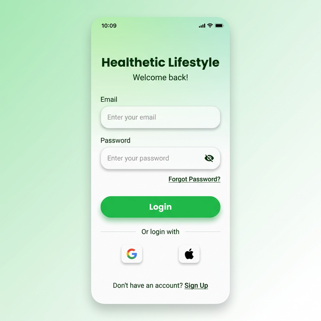
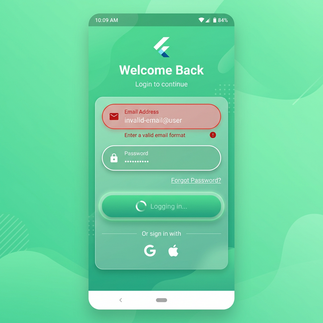

# Healthetic Flutter Login Assignment

A clean, modern, and responsive Flutter Login Application built as part of the Healthetic internship assignment. This project demonstrates best practices in UI development, form validation, and animations using only built-in Flutter libraries.

## 📱 Screenshots

| Idle Login Screen | Validation & Local States |
| --- | --- |
|  |  |


## 🚀 Features
- **Splash Screen**: Branded entry with locked portrait orientation.
- **Responsive UI**: Optimized for mobile screens (360px - 414px width).
- **Form Validation**: Real-time validation for:
  - Required fields.
  - Valid email format (Regex: `^[a-zA-Z0-9._%+-]+@...`).
  - Password minimum length (6 characters).
- **Animations**:
  - Fade-in transitions for screens.
  - Scale animation (0.98 → 1.0) on button press.
- **Simulated Login**: Handles asynchronous states with loading indicators and success snacking messages.

## 🛠️ Prerequisites
- **Flutter Version**: Flutter SDK (Stable Channel)
- **Dart Version**: Compatible with current Flutter stable version.

## ⚙️ Setup Instructions
Follow these steps to run the application locally:

1. **Clone the repository:**
   ```bash
   git clone https://github.com/kaifsherdi1/healthetic-flutter-login-assignment-kaifsherdi.git
   cd healthetic-flutter-login-assignment-kaifsherdi
   ```

2. **Initialize dependencies:**
   ```bash
   flutter pub get
   ```

3. **Run the application:**
   ```bash
   flutter run
   ```


## 🧩 Approach & Methodology
- **Clean Architecture**: The project follows a modular structure (`constants`, `widgets`, `screens`) to ensure maintainability and high code readability.
- **Built-in Only**: Adhered strictly to using only `flutter/material.dart` and `flutter/services.dart`, avoiding all external packages.
- **Performance**: Optimized rendering by using `StatefulWidget` only where necessary and keeping local widget state updates efficient.
- **Design Decisions**: 
  - Used a soft green gradient background to evoke "Health" and "Vitality".
  - Implemented 8px and 12px border radii for a soft, modern look.
  - Interactive validation provides immediate feedback, enhancing the UX.

## 📜 Suggested Commit History
Following these steps ensures a logical development flow:
1. `Initial Flutter project setup`
2. `Created splash screen`
3. `Built login UI layout`
4. `Implemented form validation`
5. `Added button loading state`
6. `Added animations and polish`
7. `Updated README and documentation`

---

